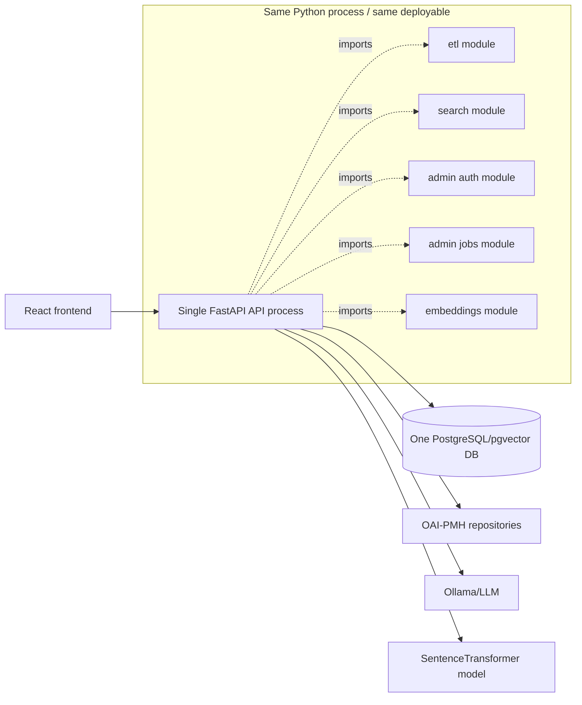
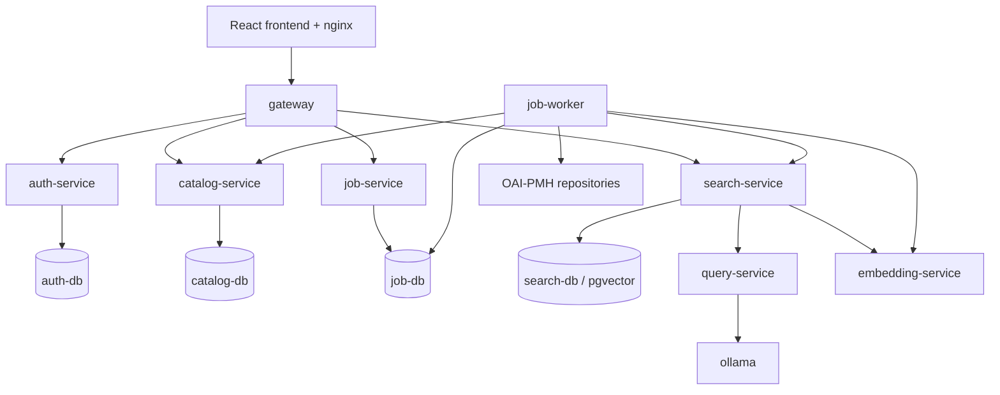
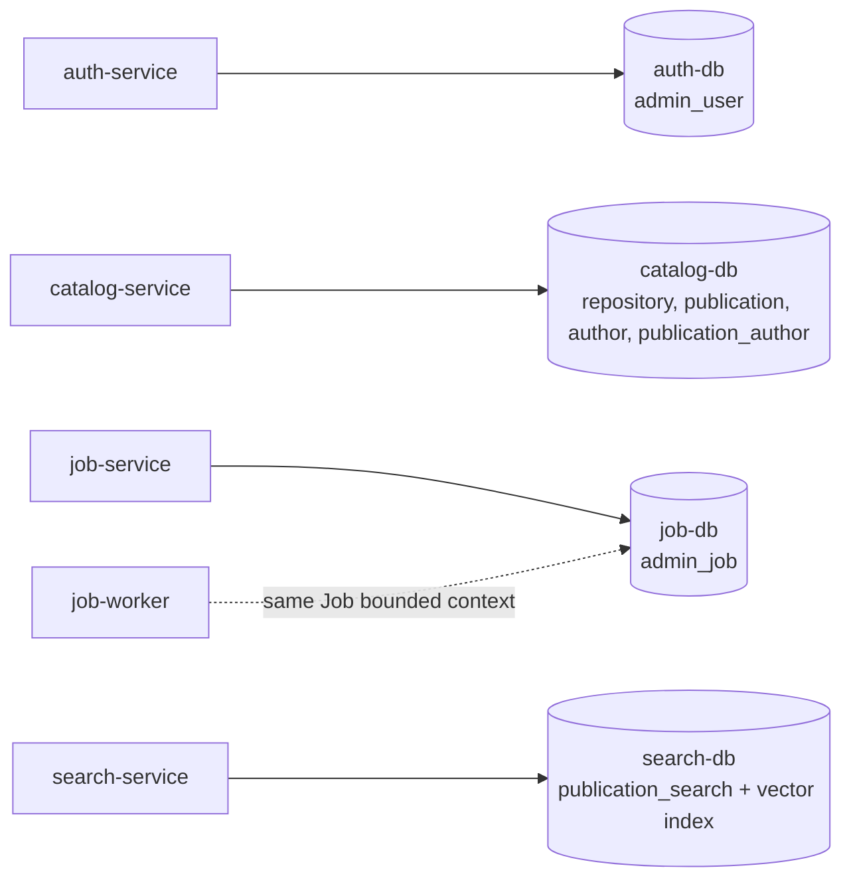
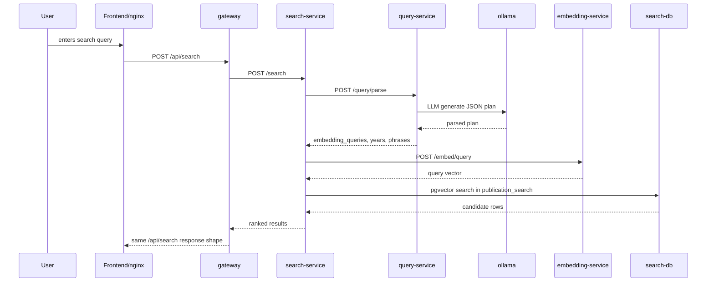
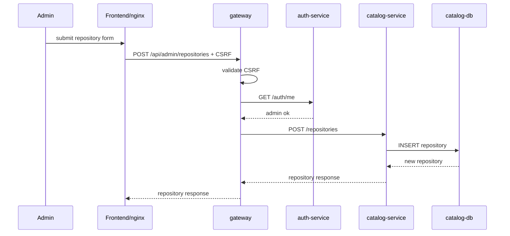
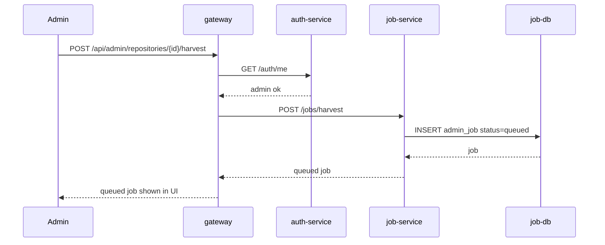
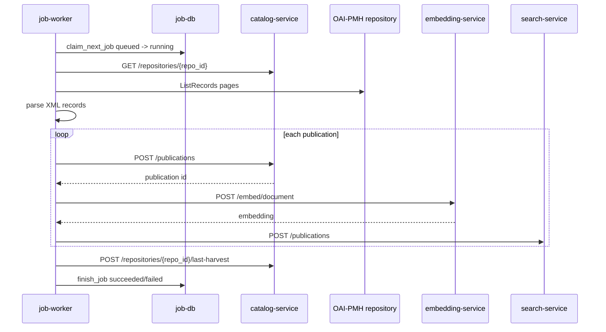
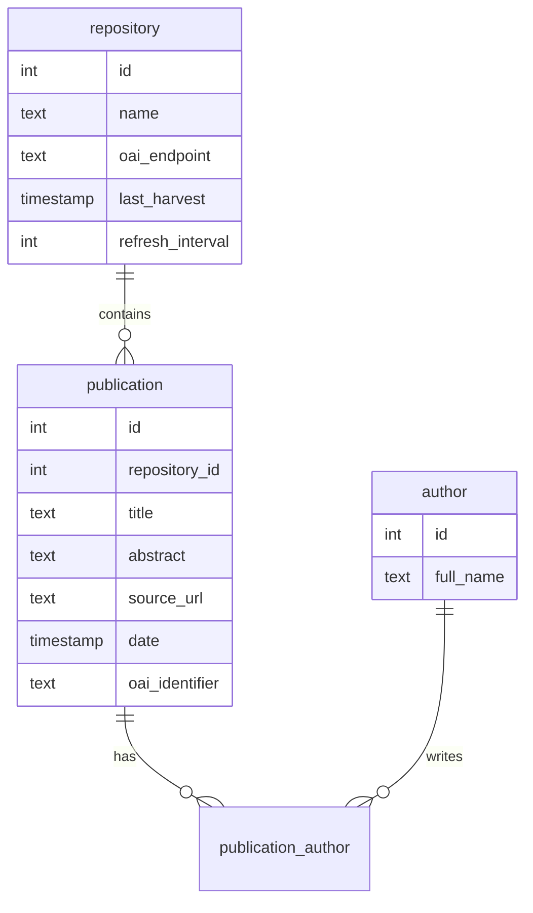

# Repo Search microservice architecture

Ovaj dokument opisuje branch `microservice-architecture`. Objasnjenje je pisano "Serbian-friendly": recenice su jednostavne, ali su standardni termini kao `gateway`, `service`, `source of truth`, `read model`, `pgvector`, `worker`, `healthcheck` i `bounded context` ostavljeni na engleskom.

## 1. Conceptual old monolith

Pre ove grane aplikacija je bila modularni monolit. To znaci: kod je bio podeljen u module/foldere, ali se u runtime-u ponasao kao jedna backend aplikacija sa jednom bazom.

Stari backend je sada sacuvan u `legacy_monolith/backend`. Najvazniji delovi su:

- `legacy_monolith/backend/api/main.py`: jedan FastAPI proces je drzao sve HTTP rute pod `/api`.
- `legacy_monolith/backend/api/services.py`: API sloj je direktno pozivao search i database helper funkcije.
- `legacy_monolith/backend/api/admin_jobs.py`: admin harvest i embedding poslovi su pokretani kao FastAPI `BackgroundTasks`.
- `legacy_monolith/backend/etl/*`: OAI-PMH harvesting, XML parsing, repository metadata i upis publikacija.
- `legacy_monolith/backend/search/*`: query parsing i semantic search.
- `legacy_monolith/backend/embeddings/*`: SentenceTransformer model i embedding backfill.
- `legacy_monolith/backend/migrations/001_initial_schema.sql`: jedna baza je sadrzala `repository`, `author`, `publication`, `publication_author`, `admin_user`, embedding kolonu i pgvector indeks.
- `legacy_monolith/backend/migrations/002_admin_jobs.sql` i `003_admin_job_acknowledged.sql`: job tabela je takodje bila u istoj bazi.

U monolitu je `legacy_monolith/backend/api/main.py` importovao skoro sve backend module. Na primer:

- `api.services.run_search()` je pozivao `search.query_handler.parse_query()` i `search.search.semantic_search()`.
- `api.admin_jobs.queue_repository_harvest()` je dodavao `BackgroundTasks` koji su zvali `etl.main.harvest_repository()`.
- `api.main` je na startup-u mogao da pokrene migracije i ucita embedding model preko `embeddings.model.warm_up_embedding_model()`.

Konceptualno:

Ovo je modularno, ali nije microservice arhitektura zato sto nema nezavisne backend procese, nema odvojene baze po ownership-u, nema network boundary izmedju backend delova i ne postoji odvojeno skaliranje search-a, auth-a, embeddings-a ili job worker-a.

## 2. What changed in the microservice version

Nova verzija uvodi vise backend procesa pod `microservices/`. Svaki proces startuje drugi module path iz istog `Dockerfile.microservice`, ali runtime role su odvojene:

- `gateway`: javni API ulaz kompatibilan sa postojecim frontend rutama.
- `auth-service`: admin login, JWT cookie, session rotation i CSRF.
- `catalog-service`: source of truth za repositories, publications i authors.
- `search-service`: pgvector read model i search ranking.
- `query-service`: natural-language query parsing preko LLM-a, sa fallback parserom.
- `embedding-service`: SentenceTransformer inference service.
- `job-service`: job API i job state.
- `job-worker`: background worker koji obradjuje queued jobs.

Glavna promena je granica odgovornosti:

- Monolit: jedan API proces direktno importuje i poziva sve module.
- Microservice verzija: procesi komuniciraju preko HTTP-a i internog `X-API-Key` tokena iz `microservices/common/security.py`.
- Monolit: jedna baza sadrzi sve tabele.
- Microservice verzija: postoje odvojene baze `auth-db`, `catalog-db`, `job-db`, `search-db`.
- Monolit: embedding model je ucitan u API procesu.
- Microservice verzija: embedding model je izolovan u `embedding-service`.
- Monolit: FastAPI `BackgroundTasks` rade harvest/backfill unutar API procesa.
- Microservice verzija: `job-service` cuva poslove, a `job-worker` ih poll-uje i izvrsava.

High-level slika:

## 3. Why the old backend folders moved into `legacy_monolith/`

Na branch-u je stari root backend uklonjen iz aktivnog runtime-a i premesten u `legacy_monolith/backend`. To je dokumentovano u `README.md` i `legacy_monolith/README.md`.

Praktican razlog: stari `api`, `etl`, `search`, `embeddings`, `migrations`, `Dockerfile.api` i `test_search.py` ostaju kao referenca za poredenje, ali nisu deo microservice Docker image-a. `Dockerfile.microservice` kopira samo `requirements.txt` i `microservices/`, pa legacy kod ne moze slucajno da se importuje iz novih servisa.

Arhitektonski razlog: premestanje jasno odvaja:

- active implementation: `microservices/` i `docker-compose.microservices.yml`
- historical/reference implementation: `legacy_monolith/backend` i `legacy_monolith/docker-compose.monolith.yml`

Za kurs je ovo korisno jer se moze pokazati evolucija: isti domen, ali dva nacina organizacije runtime-a.

## 4. Services

### `gateway`

File: `microservices/gateway/main.py`

`gateway` je public-facing backend entrypoint. Frontend i nginx salju sve `/api/*` pozive ka gateway-u. Gateway zatim poziva odgovarajuci internal service.

Vazne funkcije/rute:

- `health()` agregira health iz `catalog-service`, `search-service`, `job-service` i `auth-service`.
- `repositories()` proxy-uje `/api/repositories` ka `catalog-service`.
- `stats()` kombinuje `catalog-service /stats` i `search-service /embeddings/status`.
- `search()` proxy-uje `/api/search` ka `search-service`.
- `auth_proxy()` proxy-uje `/api/auth/*` ka `auth-service`.
- `admin_repositories()` spaja repository podatke iz Catalog-a i job podatke iz Job service-a.
- `admin_harvest_repository()` pravi harvest job preko `job-service`.
- `admin_embeddings()` racuna missing embeddings iz Catalog stats + Search embedding status + Job status.
- `admin_embedding_backfill()` pravi embedding backfill job.
- `acknowledge_job()` prosleduje acknowledgement ka `job-service`.

Gateway takodje radi admin zastitu preko `require_admin_request()`: proverava CSRF token za unsafe metode i zove `auth-service /auth/me` da potvrdi admin session.

Gateway nema sopstvenu bazu jer ne poseduje domain data. Njegova uloga je routing, aggregation i compatibility layer za frontend.

### `auth-service`

Files: `microservices/auth_service/main.py`, `microservices/auth_service/auth.py`

`auth-service` poseduje admin identity. Njegova baza je `auth-db`.

Vazne funkcije:

- `ensure_admin_schema()` kreira tabelu `admin_user`.
- `hash_password()` i `verify_password()` rade PBKDF2 password hashing.
- `build_access_token()` kreira JWT.
- `set_admin_cookie()` postavlja HTTP-only admin cookie i CSRF cookie.
- `require_admin_user()` validira JWT iz cookie-ja.
- `require_csrf_token()` validira CSRF za logout.

Rute u `main.py`:

- `POST /auth/register`
- `POST /auth/login`
- `GET /auth/me`
- `POST /auth/logout`
- `GET /health`

Ovo je pravi service boundary: admin user tabela nije u Catalog ili Job bazi.

### `catalog-service`

File: `microservices/catalog_service/main.py`

`catalog-service` je source of truth za katalog: repositories, publications i authors. Njegova baza je `catalog-db`.

Schema se kreira u `ensure_schema()`:

- `repository`
- `author`
- `publication`
- `publication_author`

Vazne funkcije/rute:

- `create_catalog_repository()` validira i upisuje repository.
- `update_catalog_repository()` menja repository.
- `repositories()` vraca listu repozitorijuma.
- `repository(repo_id)` vraca jedan repository.
- `stats()` vraca broj repositories/publications i poslednji harvest datum.
- `publications()` vraca publikacije sa autorima, koristi se za embedding backfill.
- `upsert_publication()` upisuje ili azurira publikaciju i njene autore.
- `update_last_harvest()` postavlja `last_harvest = NOW()`.

Catalog DB ne cuva embeddings. To je namerna podela: Catalog cuva canonical business data, dok Search cuva search-optimized kopiju.

Napomena iz pregleda koda: u trenutnoj verziji `normalize_date()` u `catalog_service/main.py` odmah vraca `None` kada `date_str` postoji, a ostatak date parsing logike izgleda ostao nedostupan zbog pogresnog mesta u fajlu. Za arhitekturu je namera jasna, ali ovo je implementacioni rizik za datume u Catalog DB-u.

### `search-service`

File: `microservices/search_service/main.py`

`search-service` poseduje Search DB, tj. denormalized read model za semantic search. Njegova baza je `search-db`.

Schema se kreira u `ensure_schema()`:

- `CREATE EXTENSION IF NOT EXISTS vector`
- `publication_search`
- `embedding vector(1024)`
- IVFFlat pgvector indeks na embedding koloni

Vazne funkcije/rute:

- `parse_search_query()` zove `query-service /query/parse`; ako ne uspe, koristi `parse_query_fallback()`.
- `embed_query()` zove `embedding-service /embed/query`.
- `fetch_vector_results()` izvrsava pgvector cosine-distance query nad `publication_search`.
- `search()` je glavna search ruta: parsira query, pravi embeddings, spaja rezultate, dodaje phrase boost, coverage boost i score.
- `embedding_status()` broji indexed/missing embeddings.
- `upsert_publication()` upisuje denormalized publikaciju i embedding u `publication_search`.

Search service ne cuva normalizovane autore kao posebne redove; cuva `authors TEXT[]`. To je read-model pristup: struktura je optimizovana za brzo citanje rezultata, ne za canonical editovanje podataka.

### `query-service`

Files: `microservices/query_service/main.py`, `microservices/query_service/query_handler.py`, `microservices/query_service/parser.py`, `microservices/query_service/llm_parser.py`

`query-service` pretvara user query u search plan.

Rute/funkcije:

- `POST /query/parse` u `main.py` zove `parse_query()`.
- `parse_query()` prvo proba LLM parser (`parse_query_llm()`), zatim repair (`repair_query_plan()`), a na kraju fallback parser.
- `normalize_plan()` proverava da LLM vrati validan JSON shape.
- `extract_year_constraints()` i `parse_query_fallback()` rade deterministic parsing za godine i osnovni semantic query.

Nema bazu jer nema trajne poslovne podatke. On je stateless transformation service: input je tekst, output je plan.

### `embedding-service`

Files: `microservices/embedding_service/main.py`, `microservices/embedding_service/model.py`

`embedding-service` drzi SentenceTransformer model `intfloat/multilingual-e5-large` i vraca vector embeddings.

Rute/funkcije:

- `startup()` poziva `warm_up_embedding_model()`.
- `embed_query()` generise embedding za query prefix `query: ...`.
- `embed_document()` generise embedding za document text koji pravi `build_document_text()`.
- `model.py` bira `cuda` ako je dostupna, inace `cpu`.

Nema aplikacionu bazu jer ne poseduje domain data. Ima `model_cache` Docker volume za Hugging Face/SentenceTransformers cache. To je cache/artifact storage, ne poslovna baza.

### `job-service`

File: `microservices/job_service/main.py`

`job-service` poseduje job state. Njegova baza je `job-db`.

Schema se kreira u `ensure_schema()`:

- `admin_job`
- job type constraint: `repository_harvest` ili `embedding_backfill`
- status constraint: `queued`, `running`, `succeeded`, `failed`
- unique partial indexes koji sprecavaju dva aktivna harvest-a za isti repository ili dva aktivna embedding backfill-a

Rute/funkcije:

- `jobs()` lista poslove.
- `create_harvest_job()` pravi queued repository harvest job.
- `create_embedding_backfill_job()` pravi queued embedding backfill job.
- `create_job()` centralni insert u `admin_job`.
- `acknowledge_job()` markira zavrseni job kao acknowledged.

U monolitu su poslovi odmah bili `running` i radili su kroz FastAPI `BackgroundTasks`. U microservice verziji `job-service` samo kreira queued state, a worker ga obradjuje.

### `job-worker`

File: `microservices/workers/job_worker.py`

`job-worker` nije HTTP service. Startuje se komandnom `python -m microservices.workers.job_worker`.

Vazne funkcije:

- `claim_next_job()` uzima sledeci `queued` job iz `job-db` i atomarno ga prebacuje u `running` preko `FOR UPDATE SKIP LOCKED`.
- `finish_job()` upisuje finalni status.
- `harvest_repository()` cita repository iz `catalog-service`, fetchuje OAI-PMH stranice, parsira XML i upisuje publikacije.
- `sync_publication_to_search()` zove `embedding-service /embed/document`, pa `search-service /publications`.
- `backfill_embeddings()` cita sve publikacije iz Catalog-a i ponovo puni Search read model.
- `run_job()` dispatch-uje po `job_type`.
- `main()` je infinite polling loop.

`job-worker` nema svoju bazu. U ovoj implementaciji on direktno koristi `job-db` zato sto je prakticno worker deo istog Job bounded context-a kao `job-service`. Ako se gleda strogo microservice pravilo, direktan pristup worker-a `job-db` je pojednostavljenje; cistija varijanta bi bila da worker claim/finish radi preko Job service API-ja ili da se `job-service` i `job-worker` tretiraju kao jedan service sa dva procesa.

## 5. Databases and ownership

### `auth-db`

Owned by `auth-service`.

Why: admin credentials and sessions are a separate security concern. Other services do not need password hashes or admin identity tables.

Main table: `admin_user`, created by `microservices/auth_service/auth.py::ensure_admin_schema()`.

### `catalog-db`

Owned by `catalog-service`.

Why: repository metadata, publications and authors are canonical business data. This is the system of record.

Main tables: `repository`, `author`, `publication`, `publication_author`, created by `microservices/catalog_service/main.py::ensure_schema()`.

### `job-db`

Owned by Job bounded context (`job-service` API plus `job-worker` process).

Why: harvest/backfill status, queueing, acknowledgement and progress belong to job management, not to Catalog or Search.

Main table: `admin_job`, created by `microservices/job_service/main.py::ensure_schema()`.

### `search-db`

Owned by `search-service`.

Why: semantic search needs denormalized rows and pgvector indexes. That is a query/read optimization, not the canonical representation.

Main table: `publication_search`, created by `microservices/search_service/main.py::ensure_schema()`.

## 6. Services without their own databases

- `gateway`: no domain state; only routing, aggregation, auth check delegation and frontend compatibility.
- `query-service`: stateless query-to-plan transformation; LLM/Ollama is external dependency.
- `embedding-service`: stateless inference from text to vector; `model_cache` is a cache volume, not domain DB.
- `job-worker`: no dedicated database; it uses `job-db` as part of the Job bounded context and calls other services for Catalog/Search writes.

## 7. Data flows

### A user searches

Code path:

- Frontend uses `frontend/src/App.tsx` and `frontend/src/api/client.ts::fetchJson()`.
- Gateway route: `microservices/gateway/main.py::search()`.
- Search route: `microservices/search_service/main.py::search()`.
- Query parsing: `search_service.parse_search_query()` -> `query_service.main.parse()` -> `query_handler.parse_query()`.
- Query embedding: `search_service.embed_query()` -> `embedding_service.main.embed_query()`.
- DB read: `search_service.fetch_vector_results()`.

### An admin adds a repository

Code path:

- Frontend admin calls are in `frontend/src/components/AdminPanel.tsx`.
- CSRF/header setup is in `frontend/src/api/client.ts`.
- Gateway admin protection is `microservices/gateway/main.py::require_admin_request()`.
- Gateway creation route is `admin_create_repository()`.
- Catalog write is `catalog_service.main.create_repository()` -> `create_catalog_repository()`.

### An admin starts a harvest

Code path:

- Gateway: `admin_harvest_repository()`.
- Job API: `job_service.main.create_harvest_job()` -> `create_job()`.
- Unique indexes in `job_service.ensure_schema()` prevent duplicate queued/running jobs.

### A harvest completes

Code path:

- Worker loop: `job_worker.main()`.
- Claiming: `claim_next_job()`.
- Harvest: `harvest_repository()`.
- XML parsing: `microservices/workers/parser.py::parse_oai_xml()`.
- Catalog write: `catalog_service.main.upsert_publication()`.
- Search sync: `job_worker.sync_publication_to_search()`.
- Final state: `finish_job()`.

### Embeddings are generated

Embeddings are generated in two places:

1. During harvest, per publication:
   - `job_worker.harvest_repository()` parses one record.
   - It writes canonical data to Catalog.
   - It calls `sync_publication_to_search()`.
   - `sync_publication_to_search()` calls `embedding-service /embed/document`.
   - Then it writes the publication plus embedding to Search.

2. During explicit backfill:
   - Admin calls `POST /api/admin/embeddings/backfill`.
   - Gateway calls `job-service /jobs/embedding-backfill`.
   - Worker runs `backfill_embeddings()`.
   - Worker reads all Catalog publications through `catalog-service /publications`.
   - Worker regenerates embeddings and upserts Search read model.

## 8. Catalog DB vs Search DB split

This is the most important architectural idea in this repo.

### Catalog as source of truth

`catalog-db` is canonical. Ako hoces da znas "sta stvarno postoji u sistemu", gledas Catalog:

- Which repositories exist?
- Which publications were harvested?
- Which authors belong to a publication?
- What is the canonical `oai_identifier`?
- When was repository last harvested?

Catalog is normalized:

### Search as denormalized pgvector read model

`search-db` is optimized for one read use case: semantic search. It duplicates fields from Catalog into `publication_search`:

- `id`
- `repository_id`
- `repository_name`
- `title`
- `abstract`
- `source_url`
- `date`
- `oai_identifier`
- `authors TEXT[]`
- `embedding vector(1024)`

This means Search can answer one query without joining Catalog tables or calling Catalog on every result. It can use pgvector index directly.

Tradeoff:

- Pro: search is faster and simpler.
- Pro: Catalog schema can remain normalized.
- Pro: Search service owns search-specific indexes.
- Con: duplicated data can become stale.
- Con: worker/backfill must keep Search in sync.

In this implementation, consistency is eventual. Catalog is written first, then Search is updated. If Search update fails, Catalog may still contain the publication while Search misses it until backfill runs again.

## 9. Why frontend is separate but not a microservice

`frontend/` is a separate deployable container, but it is not a microservice in the backend/domain sense.

Reasons:

- It does not own business capability like Auth, Catalog, Search or Jobs.
- It does not own a database.
- It is a user interface, not a domain service.
- It serves static React assets via nginx.
- Its API interaction is always through `/api/*`, proxied by nginx to `gateway`.

Relevant files:

- `frontend/Dockerfile`: builds React with `npm run build`, then serves it from nginx.
- `docker/nginx/default.conf.template`: `/api/` is proxied to `${API_UPSTREAM}` and injects `X-API-Key`.
- `frontend/src/api/client.ts`: shared frontend fetch helper, CSRF header handling and `credentials: "same-origin"`.

So frontend is better described as "separate presentation layer" or "frontend container", not microservice.

## 10. How Docker Compose runs the cluster

`docker-compose.microservices.yml` defines the runtime cluster:

- Four PostgreSQL/pgvector databases:
  - `auth-db`
  - `catalog-db`
  - `job-db`
  - `search-db`
- Backend services built from `Dockerfile.microservice`:
  - `gateway`
  - `auth-service`
  - `catalog-service`
  - `search-service`
  - `query-service`
  - `embedding-service`
  - `job-service`
  - `job-worker`
- `frontend` built from `frontend/Dockerfile`.
- `ollama` for LLM parsing.

Each backend container uses the same image build, but a different command:

- `uvicorn microservices.gateway.main:app`
- `uvicorn microservices.auth_service.main:app`
- `uvicorn microservices.catalog_service.main:app`
- `uvicorn microservices.search_service.main:app`
- `uvicorn microservices.query_service.main:app`
- `uvicorn microservices.embedding_service.main:app`
- `uvicorn microservices.job_service.main:app`
- `python -m microservices.workers.job_worker`

`depends_on` with `condition: service_healthy` makes Compose wait for databases and required services before starting dependents. Healthchecks call `/health` endpoints with the internal `X-API-Key`.

Important exposed host ports:

- Gateway: default `localhost:8090`
- Frontend: default `localhost:8091`
- Ollama in this cluster: default `localhost:11435`

Important volumes:

- `auth_db_data`, `catalog_db_data`, `job_db_data`, `search_db_data`: persistent DB data.
- `harvest_xml_data`: XML pages saved by worker under `/app/data`.
- `model_cache`: Hugging Face/SentenceTransformers model cache.
- `ollama_microservice_data`: Ollama model data.

## 11. Important files

### `docker-compose.microservices.yml`

Defines the whole cluster: databases, backend services, worker, frontend, Ollama, ports, healthchecks, environment variables and volumes.

This is the main runtime map of the architecture.

### `Dockerfile.microservice`

Builds the shared Python image for all backend services:

- base: `python:3.13-slim`
- installs `requirements.txt`
- sets model cache env vars
- copies `microservices/`
- default command points to gateway, but Compose overrides it per service.

Because it copies only `microservices/`, `legacy_monolith/` is not part of the active backend image.

### `microservices/`

The active backend implementation. Each subfolder is a service or shared module:

- `gateway/`
- `auth_service/`
- `catalog_service/`
- `search_service/`
- `query_service/`
- `embedding_service/`
- `job_service/`
- `workers/`
- `common/`

### `microservices/common/`

Shared infrastructure code:

- `config.py`: env helpers and `service_url()`.
- `db.py`: PostgreSQL `get_connection()` based on service-specific DB env vars.
- `http.py`: `proxy_request()` and `raise_for_service()`.
- `security.py`: `require_api_token()` and `internal_headers()`.
- `schemas.py`: shared Pydantic response/request models.

This is useful for demo simplicity, but in a stricter microservice architecture shared libraries must be managed carefully because they can couple independent services.

### `legacy_monolith/`

Reference copy of old backend and old Compose file. It is not active in the new cluster.

### `README.md`

Operational quickstart for the microservice branch: prerequisites, env setup, Compose commands, service list, DB list, useful commands and legacy note.

## 12. What is real microservice architecture here, and what is simplified

### Real microservice/SOA elements

- Multiple independently running backend processes.
- API gateway pattern.
- Service-to-service HTTP calls.
- Database-per-service ownership for Auth, Catalog, Jobs and Search.
- Separate read model for Search.
- Background worker separated from request/response API path.
- Separate model inference service for embeddings.
- Healthchecks and Compose-level service dependencies.
- Internal API token for service calls.

### Simplified for course/demo

- All Python backend services are built from one repo and one `Dockerfile.microservice`; this is a monorepo deployment style, not independent repos/pipelines.
- Services share `microservices/common/` code directly. Practical for a course, but it creates compile-time coupling.
- No message broker. Job queueing is implemented with PostgreSQL polling and `FOR UPDATE SKIP LOCKED`.
- `job-worker` directly accesses `job-db`. This is acceptable if worker is considered part of the Job bounded context, but it is simplified compared to strict API-only service isolation.
- Inter-service auth is a single shared `API_TOKEN`, not mTLS, OAuth2 client credentials, service mesh, or per-service identity.
- No distributed tracing, centralized logging, retries/circuit breakers, or service discovery beyond Docker DNS names.
- Catalog-to-Search synchronization is manual/eventual through worker/backfill, not event streaming.
- Schemas are created by service startup code, not by robust migration tooling per service.
- Compose runs everything on one machine. This is microservice-style architecture, not production Kubernetes/cloud deployment.
- Search DB and Catalog DB can diverge until backfill repairs the read model.

## 13. Short explanation for presenting in class

The old application was a modular monolith: one FastAPI backend, one PostgreSQL/pgvector database, and modules for auth, ETL, search, embeddings and jobs. It was organized in folders, but deployed and executed as one backend.

The new branch turns that into a microservice-style cluster. The frontend talks only to `gateway`. Gateway delegates auth to `auth-service`, catalog data to `catalog-service`, semantic search to `search-service`, and job creation/status to `job-service`. Search calls `query-service` for LLM query parsing and `embedding-service` for vectors. Long-running harvest/backfill work is done by `job-worker`.

The most important design choice is the split between Catalog DB and Search DB. Catalog DB is the source of truth: normalized repositories, publications and authors. Search DB is a denormalized pgvector read model: duplicated publication fields plus embeddings, optimized for fast semantic search. The worker keeps Search updated when harvest or backfill runs.

This is a real microservice-style refactor in terms of runtime processes, HTTP boundaries, and database ownership. It is still a course/demo version because it uses one repository, shared common code, Compose, PostgreSQL polling instead of a broker, and simple shared-token service auth.
